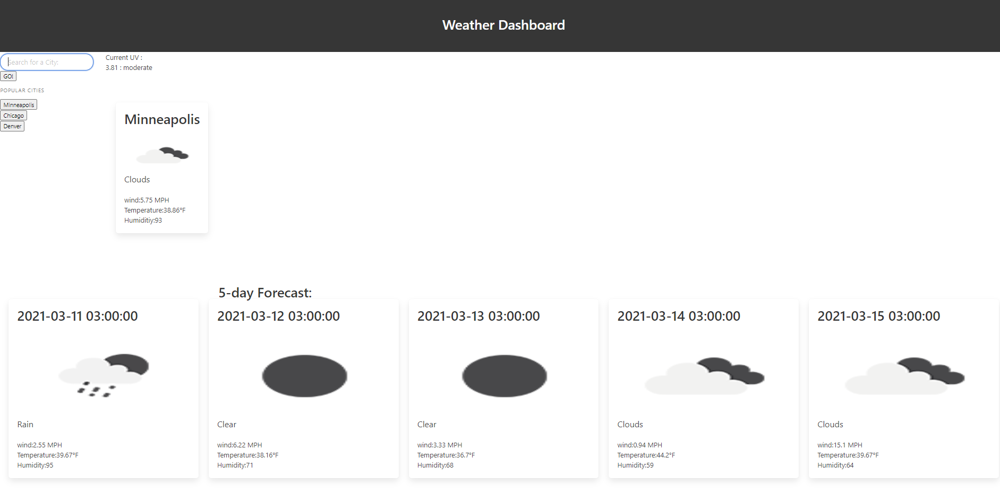

# 06 Server-Side APIs: Weather Dashboard

## Description

Here we have a Weather Dashboard made via javascript and html to show current weather and forcast weather of different places around the world. 

## To test: 

you can either run on your local machine by downloading then opening the index.html in browser or user can run via github deployment link.

## Github repo and deployment link:

GitHub Repo:
<a href="https://github.com/H-garr/WeatherDashboard">github.com/H-garr/WeatherDashboard</a>
<a href="https://h-garr.github.io/WeatherDashboard/">Deployment Link</a>

## Questions and Concerns:
Contact me at :
<a href="https://hagarrard@gmail.com">hagarrard@gmail.com</a>

## Walkthrough Video & Picture: 

<a href="https://drive.google.com/file/d/1SUoXsOnsFeoDopNn4dM4hqwc5WwtOYCB/view">Video Here</a>
- - -
© 2021 Trilogy Education Services, LLC, a 2U, Inc. brand. Confidential and Proprietary. All Rights Reserved.
